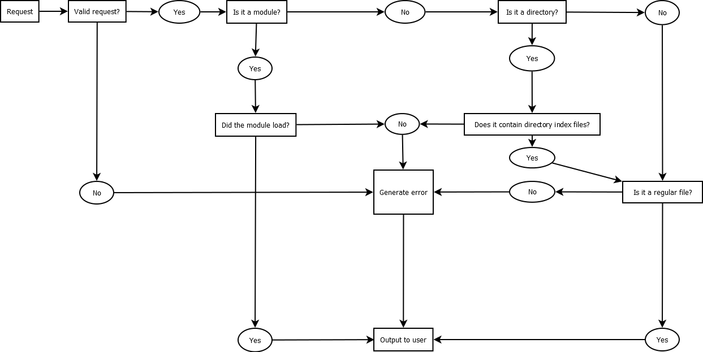

C++ WebServer
===================

Prosjektoppgaven i C++ 2013

## Prosjektinformasjon
### Abstrakt

Målet er å lage en liten effektiv webserver kryss-kompatibel med Mac, Windows og Linux. Web Serveren skal **ikke** støtte annet enn GET. HTML/JS/CSS filer skal sendes "as is" som plain text, mens dynamiske nettsider skal lastes via linket C++-program. 

### Mål

* Abstrahert - webserveren skal lett kunne utvides i senere tid, med støtte for eksempelvis POST
* WebServeren bør kunne integreres mot andre språk, som for eksempel PHP, i senere tid.
* Siden WebServeren er liten, må også effektiviteten være på topp. Det vil si rask responstid, lav CPU og minnebruk.
* WebServeren bør kunne skaleres ved mange requests

### Gruppeinformasjon
David Steinsland, s180486, david@davidsteinsland.net


----------

## Spesifikasjoner

### Features

* Støtte for GET og POST
* Støtte for statiske filer og dynamiske moduler (linket C++-programmer)
* Worker-tråder gjennom et worker pool
* Kryss-kompatibel med Windows/Unix
* Windows-versjonen benytter seg av `winsock` og Windows-tråder, slik at den kan debugges på Windows også
* Enkelt og oversiktlig API

### Designvalg
Webserveren er skrevet i **ANSI** C++, dvs. C++98-standarden. Siden _condition variables_ og _mutexes_ fikk eget bibliotek først i C++11, så er dette blitt implementert på egenhånd. Det samme gjelder tråder og sockets.

Serveren er bygget rundt prinsippet _Thread pool pattern_, slik at det startes et bestemt antall arbeidstråder som står for å behandle klientene. Trådene blir administrert gjennom en _worker pool_ , som inneholder en trådsikker liste (_Blocking queue_) med klienter som skal behandles.

### Støttede arkitekturer
Serveren er bygget på Windows og Ubuntu, og testet grundig på begge operativsystem. I teorien skal de fleste UNIX-systemer være kompatibel siden Ubuntu er et subset av dette. Likevel kan det forekomme tilfeller hvor mindre endringer trengs. **Mac OS er ikke støttet i hele tatt**: Jeg har ingen Mac tilgjengelig, så jeg kan verken si ja eller nei til hvorvidt webserveren fungerer der.

### Livstiden til en request:


**webserver::handle_request**:



### Bygging

Det finnes én `Makefile` for Windows (MinGW) og én for UNIX-miljøer.

**Bygge prosjektet**

Windows:

```bash
mingw32-make -f Makefile.mingw
```

Unix:

```bash
make
```

**Bygge moduler**

Windows:

```bash
mingw32-make -f Makefile.mingw modules
```

Unix:

```bash
make modules
```

### Installering av web server

**UNIX:**

`make install` vil installere de nødvendige komponentene i mappen `build/`.

```bash
make && make install
```

**Windows:**

```bash
mingw32-make -f Makefile.mingw && mingw32-make -f Makefile.mingw install
```

## Installering av nye moduler

Moduler som skal brukes av serveren må finnes i `modules/`-mappen, og ha en `.dll`-endelse dersom bruk på Windows og `.so` på UNIX. Merk også at det er litt ulik syntaks mellom en Windows- og Unix-modul.

På Windows må man definere to ekstra funksjoner, samt at metodesignaturen er litt ulik. Modulen blir også bygget på en litt annen måte. **Biblioteket, `libsol.a` er lik for begge arkitekturer**.

Hvis du har en modul som heter "page.so", så vil denne kunne nås via URL-en: `http://example.com/page`

Dersom det trengs, støtter webserveren undermapper i modul-mappen. Dvs. om du har en modul som du vil nå via `http://example.com/dir/modulename`, så kan denne lagres i `modules/dir/modulename.so`.

## Kjøring

```bash
cd build/
./solhttpd
```

På noen servere kommer det noen `Permission denied`-feilmeldinger, og da må programmet kjøres som root:

```bash
cd build/
sudo ./solhttpd
```

**Som Daemon**:

```bash
build/solhttpd.sh start
```

init-scriptet **må** ligge i samme mappe som programmet for at det skal fungere ordentlig.

## TODO

* Implementere FastCGI med støtte for PHP, Python, o.l.


----------