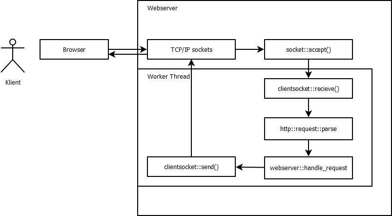

C++ WebServer
===================

Prosjektoppgaven i C++ 2013

## Abstrakt

Målet er å lage en liten effektiv webserver kryss-kompatibel med Mac, Windows og Linux. Web Serveren skal **ikke** støtte annet enn GET. HTML/JS/CSS filer skal sendes "as is" som plain text, mens dynamiske nettsider skal lastes via linket C++-program. 

## Mål

* Abstrahert - webserveren skal lett kunne utvides i senere tid, med støtte for eksempelvis POST
* WebServeren bør kunne integreres mot andre språk, som for eksempel PHP, i senere tid.
* Siden WebServeren er liten, må også effektiviteten være på topp. Det vil si rask responstid, lav CPU og minnebruk.
* WebServeren bør kunne skaleres ved mange requests

## Gruppeinformasjon
David Steinsland, s180486, david@davidsteinsland.net


----------

## Features

* Støtte for GET og POST
* Støtte for statiske filer og dynamiske moduler (linket C++-programmer)
* Worker-tråder gjennom et worker pool
* Kryss-kompatibel med Windows/Unix
* Windows-versjonen benytter seg av `winsock` og Windows-tråder, slik at den kan debugges på Windows også
* Enkelt og oversiktlig API

## Bygging

Det finnes én `Makefile` for Windows (MinGW) og én for UNIX-miljøer.


### Windows

**Bygge prosjektet**

```bash
mingw32-make -f Makefile.mingw
```

**Bygge moduler**

```bash
mingw32-make -f Makefile.mingw modules
```

### UNIX

```bash
make
```

og

```bash
make modules
```

## Installering av web server

**UNIX:**

```bash
make && make install
```

**Windows:**

```bash
mingw32-make -f Makefile.mingw && mingw32-make -f Makefile.mingw install
```

## Installering av nye moduler

Moduler som skal brukes av serveren må finnes i `modules/`-mappen, og ha en `.dll`-endelse dersom bruk på Windows og `.so` på UNIX. Merk også at det er litt ulik syntaks mellom en Windows- og Unix-modul:

Windows-moduler bruker `libsol.a`, mens UNIX-moduler bruker `libsol-linux.a`. Makefilene er også litt forskjellige, samt mindre C++-spesifikke forskjeller. Sjekk eksempel-mappene `basic` og `hello` for eksempler.

Hvis du har en modul som heter "page.so", så vil denne kunne nås via URL-en: `http://example.com/page`

## Kjøring

```bash
cd build/
./solhttpd
```

På noen servere kommer det noen `Permission denied`-feilmeldinger, og da må programmet kjøres som root:

```bash
cd build/
sudo ./solhttpd
```

## TODO

* Implementere FastCGI med støtte for PHP, Python, o.l.


----------

## Flow-chart
